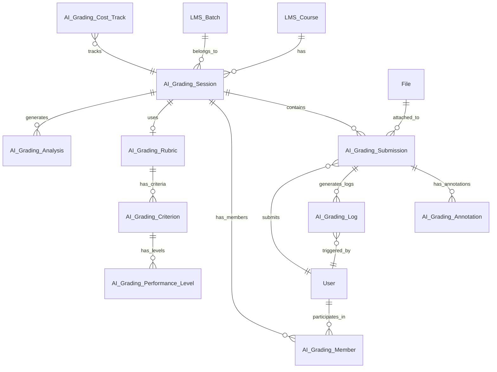

# AI Grading Database Schema Design

> **Comprehensive database schema design for AI-powered grading system** based on research from Moodle, MarkUs, Autolab and existing Frappe LMS implementation.
>
> **Last Updated:** 2026-04-13

---

## Table of Contents

1. [Executive Summary](#executive-summary)
2. [Research Insights from Open-Source Systems](#research-insights)
3. [Current LMS AI Grading Analysis](#current-lms-analysis)
4. [Proposed Database Schema](#proposed-database-schema)
5. [Schema Relationships (ERD)](#schema-relationships)
6. [Performance Optimizations](#performance-optimizations)
7. [Migration Strategy](#migration-strategy)

---

## Executive Summary

### Goal
Design a production-ready database schema for AI-powered grading that supports:
- Multiple assessment types (essays, multiple-choice, programming, math)
- Structured rubric-based grading with AI feedback
- Audit logging for all AI decisions
- Cost tracking for AI provider usage
- Teacher override and collaboration workflows

### Key Design Principles
1. **Modularity**: Separate concerns into distinct DocTypes
2. **Auditability**: Every AI decision is logged and traceable
3. **Flexibility**: Support multiple AI providers and grading models
4. **Scalability**: Optimized indexes for 1000+ concurrent submissions
5. **Frappe-native**: Leverage Frappe's ORM and DocType patterns

---

## Research Insights from Open-Source Systems

### 1. Moodle (PHP-based LMS)

**Key Findings:**
| Pattern | Description | Adaptation for AI |
|---------|-------------|-------------------|
| **Grade Items** | Separate table for gradable items with weighting | → `AI Grading Rubric` DocType |
| **Grade History** | Complete audit trail of grade changes | → `AI Grading Log` with action tracking |
| **Grade Categories** | Hierarchical organization of grades | → Multi-level rubric criteria |
| **Feedback Comments** | Rich-text feedback per grade | → `ai_feedback` JSON field with structured feedback |

**Database Tables Analyzed:**
- `mdl_grade_items` - Grade definitions with max score, weight, grade type
- `mdl_grade_grades` - Actual student grades with timestamp, user, raw grade
- `mdl_grade_history` - Audit trail of all grade changes
- `mdl_grade_categories` - Aggregation of grade items

### 2. MarkUs (Ruby on Rails - Submission/Grading)

**Key Findings:**
| Pattern | Description | Adaptation for AI |
|---------|-------------|-------------------|
| **Submission + File Association** | One submission, multiple attached files | → Current `paper_image` + File attachments |
| **Annotations** | In-line comments on specific file regions | → `AI Grading Annotation` child table |
| **Marking Schemes** | Flexible rubric templates per assignment | → `AI Grading Rubric Template` DocType |
| **Group Submissions** | Multiple students, one submission | → `AI Grading Submission` with `student_group` field |

**Database Schema Highlights:**
```ruby
# MarkUs - submissions table
create_table :submissions do |t|
  t.references :assignment, foreign_key: true
  t.references :group, foreign_key: true
  t.string :submission_status  # "unreleased", "released", etc.
  t.text :remark               # Overall feedback
  t.float :total_mark          # Final score
end

# MarkUs - marks table (per-criterion)
create_table :marks do |t|
  t.references :submission, foreign_key: true
  t.references :marking_scheme, foreign_key: true
  t.float :mark                 # Score for this criterion
  t.text :comment               # Feedback for this criterion
end
```

### 3. Autolab (Ruby on Rails - Auto-Grading)

**Key Findings:**
| Pattern | Description | Adaptation for AI |
|---------|-------------|-------------------|
| **Scoreboards** | Real-time ranking and progress | → `AI Grading Session` analytics |
| **Autograder Results** | Structured output from grading scripts | → `ai_feedback` JSON with detailed scoring |
| **Grace Days** | Late submission handling | → `submission_time`, `grace_period_used` fields |
| **Cheat Detection** | Similarity analysis between submissions | → `AI Grading Analysis` DocType |

**Notable Features:**
- Supports multiple autograding "handouts" per assignment
- Tracks total time spent in autograding queue
- Detailed per-test-case results in JSON format

---

## Current LMS Analysis

### Existing DocTypes (3)

| DocType | Purpose | Status |
|---------|---------|--------|
| `AI Grading Session` | Grading session container | ✅ Complete |
| `AI Grading Submission` | Student submission record | ⚠️ Partial - needs AI-specific fields |
| `AI Grading Member` | Session members (graders/viewers) | ✅ Complete |

### Current Schema Analysis

#### AI Grading Session
```json
{
  "session_name": "Math Final Exam - 2024",
  "route_slug": "math-final-exam-2024",
  "grading_type": "Exam",
  "subject": "Mathematics",
  "level": "Advanced",
  "course": "MATH-101",
  "batch": "BATCH-001",
  "reference_doc_type": "LMS Quiz",
  "reference_doc": "QUIZ-123",
  "status": "Open",
  "ai_notes": "Use Vietnamese language for feedback",
  "members": [
    {"user": "teacher@example.com", "role": "Grader"}
  ]
}
```

#### AI Grading Submission
```json
{
  "session": "MATH-FINAL-001",
  "student": "student@example.com",
  "student_name": "John Doe",
  "student_sbd": "123456",
  "status": "Pending",
  "score": null,
  "paper_image": "/files/submission_001.jpg",
  "lms_quiz_submission": "QUIZ-SUB-001",
  "lms_assignment_submission": null,
  "ai_feedback": null,
  "teacher_feedback": null,
  "ai_rating": null,
  "dissatisfaction_reason": null
}
```

### Gaps Identified

| Gap | Impact | Proposed Solution |
|-----|--------|-------------------|
| ❌ No rubric structure | Inconsistent grading | Add `AI Grading Rubric` + `AI Grading Criterion` |
| ❌ No AI decision logging | Untraceable AI outputs | Add `AI Grading Log` DocType |
| ❌ No cost tracking | Budget uncertainty | Add `AI Grading Cost Track` DocType |
| ❌ No AI model selection | Locked to single provider | Add `ai_provider`, `ai_model` fields |
| ❌ No structured feedback parsing | Feedback is opaque | Standardize `ai_feedback` JSON format |
| ❌ No annotation support | No targeted feedback | Add `AI Grading Annotation` child table |
| ❌ No retry mechanism | Failed submissions stuck | Add `retry_count`, `last_error` fields |
| ❌ No performance metrics | Can't optimize prompts | Add `grading_time`, `token_usage` fields |

---

## Proposed Database Schema

### Overview

```
New DocTypes (6):
├── AI Grading Rubric           - Rubric template for grading
├── AI Grading Criterion        - Individual grading criteria (child)
├── AI Grading Log              - Audit trail of AI decisions
├── AI Grading Cost Track       - AI provider cost tracking
├── AI Grading Annotation       - In-line feedback annotations (child)
└── AI Grading Analysis         - Similarity/quality analysis

Enhanced DocTypes (2):
├── AI Grading Session          - Add rubric, ai_provider fields
└── AI Grading Submission       - Add detailed AI result fields
```

---

### 1. AI Grading Rubric

**Purpose**: Define the scoring structure for a grading session with multiple criteria and levels.

```json
{
  "module": "LMS",
  "doctype": "AI Grading Rubric",
  "name": "RUBRIC-001",
  "fields": [
    {
      "fieldname": "rubric_name",
      "fieldtype": "Data",
      "label": "Rubric Name",
      "reqd": 1,
      "length": 100
    },
    {
      "fieldname": "description",
      "fieldtype": "Text",
      "label": "Description"
    },
    {
      "fieldname": "total_max_score",
      "fieldtype": "Float",
      "label": "Total Max Score",
      "read_only": 1,
      "default": "0"
    },
    {
      "fieldname": "grading_type",
      "fieldtype": "Select",
      "label": "Grading Type",
      "options": "Essay\nMultiple Choice\nProgramming\nMath\nMixed"
    },
    {
      "fieldname": "language",
      "fieldtype": "Select",
      "label": "Feedback Language",
      "options": "English\nVietnamese\nSpanish\nFrench\nGerman\nJapanese\nKorean\nChinese",
      "default": "English"
    },
    {
      "fieldname": "is_template",
      "fieldtype": "Check",
      "label": "Is Template",
      "default": 0
    },
    {
      "fieldname": "criteria",
      "fieldtype": "Table",
      "label": "Criteria",
      "options": "AI Grading Criterion"
    }
  ],
  "quick_filters": [
    {"fieldname": "grading_type"},
    {"fieldname": "is_template"}
  ],
  "permissions": [
    {"role": "System Manager", "read": 1, "write": 1, "create": 1, "delete": 1},
    {"role": "Moderator", "read": 1, "write": 1, "create": 1, "delete": 0},
    {"role": "Course Creator", "read": 1, "write": 1, "create": 1, "delete": 0},
    {"role": "Academic User", "read": 1, "write": 1, "create": 1, "delete": 0},
    {"role": "Instructor", "read": 1, "write": 1, "create": 1, "delete": 0},
    {"role": "LMS Student", "read": 0, "write": 0, "create": 0, "delete": 0}
  ],
  "indexes": [
    {"fieldname": "rubric_name", "unique": 0}
  ]
}
```

---

### 2. AI Grading Criterion (Child Table)

**Purpose**: Define individual scoring criteria with performance levels and weights.

```json
{
  "module": "LMS",
  "doctype": "AI Grading Criterion",
  "istable": 1,
  "fields": [
    {
      "fieldname": "criterion_name",
      "fieldtype": "Data",
      "label": "Criterion Name",
      "reqd": 1,
      "in_list_view": 1,
      "length": 100
    },
    {
      "fieldname": "description",
      "fieldtype": "Text",
      "label": "Description",
      "reqd": 1
    },
    {
      "fieldname": "max_score",
      "fieldtype": "Float",
      "label": "Max Score",
      "reqd": 1,
      "default": "10",
      "in_list_view": 1
    },
    {
      "fieldname": "weight",
      "fieldtype": "Float",
      "label": "Weight (%)",
      "default": "100",
      "in_list_view": 1
    },
    {
      "fieldname": "criterion_type",
      "fieldtype": "Select",
      "label": "Criterion Type",
      "options": "Content Quality\nStructure\nGrammar\nVocabulary\nReasoning\nAccuracy\nCreativity\nTechnical\nCustom"
    },
    {
      "fieldname": "performance_levels",
      "fieldtype": "Table",
      "label": "Performance Levels",
      "options": "AI Grading Performance Level"
    },
    {
      "fieldname": "ai_prompt_suffix",
      "fieldtype": "Text",
      "label": "AI Prompt Suffix",
      "description": "Additional context for AI evaluation of this criterion"
    }
  ],
  "permissions": []
}
```

---

### 3. AI Grading Performance Level (Child of Criterion)

**Purpose**: Define scoring levels (e.g., Excellent, Good, Average, Poor) with descriptions.

```json
{
  "module": "LMS",
  "doctype": "AI Grading Performance Level",
  "istable": 1,
  "fields": [
    {
      "fieldname": "level_name",
      "fieldtype": "Data",
      "label": "Level Name",
      "reqd": 1,
      "in_list_view": 1,
      "length": 50
    },
    {
      "fieldname": "min_score",
      "fieldtype": "Float",
      "label": "Min Score",
      "reqd": 1,
      "in_list_view": 1
    },
    {
      "fieldname": "max_score",
      "fieldtype": "Float",
      "label": "Max Score",
      "reqd": 1,
      "in_list_view": 1
    },
    {
      "fieldname": "level_description",
      "fieldtype": "Text",
      "label": "Description",
      "reqd": 1
    },
    {
      "fieldname": "sample_feedback",
      "fieldtype": "Text",
      "label": "Sample Feedback",
      "description": "Example feedback text for this level"
    }
  ],
  "permissions": []
}
```

---

### 4. AI Grading Log

**Purpose**: Complete audit trail of all AI grading decisions, enabling traceability and debugging.

```json
{
  "module": "LMS",
  "doctype": "AI Grading Log",
  "fields": [
    {
      "fieldname": "submission",
      "fieldtype": "Link",
      "label": "Submission",
      "options": "AI Grading Submission",
      "reqd": 1,
      "in_list_view": 1,
      "in_filter": 1
    },
    {
      "fieldname": "session",
      "fieldtype": "Link",
      "label": "Session",
      "options": "AI Grading Session",
      "in_list_view": 1
    },
    {
      "fieldname": "student",
      "fieldtype": "Link",
      "label": "Student",
      "options": "User",
      "in_filter": 1
    },
    {
      "fieldname": "action",
      "fieldtype": "Select",
      "label": "Action",
      "options": "Grading Started\nGrading Completed\nGrading Failed\nRetry\nTeacher Override\nFeedback Modified\nRe-graded\nAnalyzed",
      "reqd": 1,
      "in_list_view": 1,
      "in_filter": 1
    },
    {
      "fieldname": "ai_provider",
      "fieldtype": "Data",
      "label": "AI Provider",
      "options": "openai\ngemini\nanthropic\nkyma\nollama",
      "in_list_view": 1
    },
    {
      "fieldname": "ai_model",
      "fieldtype": "Data",
      "label": "AI Model",
      "in_list_view": 1
    },
    {
      "fieldname": "input_tokens",
      "fieldtype": "Int",
      "label": "Input Tokens",
      "read_only": 1
    },
    {
      "fieldname": "output_tokens",
      "fieldtype": "Int",
      "label": "Output Tokens",
      "read_only": 1
    },
    {
      "fieldname": "total_tokens",
      "fieldtype": "Int",
      "label": "Total Tokens",
      "read_only": 1
    },
    {
      "fieldname": "estimated_cost",
      "fieldtype": "Currency",
      "label": "Estimated Cost (USD)",
      "read_only": 1
    },
    {
      "fieldname": "grading_time_seconds",
      "fieldtype": "Float",
      "label": "Grading Time (seconds)",
      "read_only": 1
    },
    {
      "fieldname": "previous_score",
      "fieldtype": "Float",
      "label": "Previous Score",
      "read_only": 1
    },
    {
      "fieldname": "new_score",
      "fieldtype": "Float",
      "label": "New Score",
      "read_only": 1,
      "in_list_view": 1
    },
    {
      "fieldname": "prompt_hash",
      "fieldtype": "Data",
      "label": "Prompt Hash",
      "length": 64,
      "read_only": 1
    },
    {
      "fieldname": "response_hash",
      "fieldtype": "Data",
      "label": "Response Hash",
      "length": 64,
      "read_only": 1
    },
    {
      "fieldname": "error_message",
      "fieldtype": "Text",
      "label": "Error Message",
      "read_only": 1
    },
    {
      "fieldname": "request_payload",
      "fieldtype": "Code",
      "label": "Request Payload (JSON)",
      "read_only": 1,
      "hidden": 1
    },
    {
      "fieldname": "response_payload",
      "fieldtype": "Code",
      "label": "Response Payload (JSON)",
      "read_only": 1,
      "hidden": 1
    },
    {
      "fieldname": "triggered_by",
      "fieldtype": "Link",
      "label": "Triggered By",
      "options": "User",
      "read_only": 1
    },
    {
      "fieldname": "ip_address",
      "fieldtype": "Data",
      "label": "IP Address",
      "read_only": 1
    }
  ],
  "quick_filters": [
    {"fieldname": "action"},
    {"fieldname": "ai_provider"},
    {"fieldname": "ai_model"}
  ],
  "permissions": [
    {"role": "System Manager", "read": 1, "write": 0, "create": 0, "delete": 0},
    {"role": "Moderator", "read": 1, "write": 0, "create": 0, "delete": 0},
    {"role": "Course Creator", "read": 1, "write": 0, "create": 0, "delete": 0},
    {"role": "Academic User", "read": 1, "write": 0, "create": 0, "delete": 0},
    {"role": "Instructor", "read": 1, "write": 0, "create": 0, "delete": 0},
    {"role": "LMS Student", "read": 0, "write": 0, "create": 0, "delete": 0}
  ],
  "indexes": [
    {"fieldname": "submission"},
    {"fieldname": "session"},
    {"fieldname": "student"},
    {"fieldname": "action"},
    {"fieldname": "ai_provider"},
    {"fieldname": "created"}
  ],
  "sort_field": "created",
  "sort_order": "DESC"
}
```

---

### 5. AI Grading Cost Track

**Purpose**: Track AI provider costs for budgeting and optimization.

```json
{
  "module": "LMS",
  "doctype": "AI Grading Cost Track",
  "fields": [
    {
      "fieldname": "cost_date",
      "fieldtype": "Date",
      "label": "Cost Date",
      "reqd": 1,
      "default": "Today",
      "in_list_view": 1
    },
    {
      "fieldname": "ai_provider",
      "fieldtype": "Select",
      "label": "AI Provider",
      "options": "openai\ngemini\nanthropic\nkyma\nollama",
      "reqd": 1,
      "in_list_view": 1
    },
    {
      "fieldname": "ai_model",
      "fieldtype": "Data",
      "label": "AI Model",
      "reqd": 1,
      "in_list_view": 1
    },
    {
      "fieldname": "session",
      "fieldtype": "Link",
      "label": "Session",
      "options": "AI Grading Session"
    },
    {
      "fieldname": "submission_count",
      "fieldtype": "Int",
      "label": "Submission Count",
      "reqd": 1,
      "default": "0",
      "in_list_view": 1
    },
    {
      "fieldname": "total_input_tokens",
      "fieldtype": "Int",
      "label": "Total Input Tokens",
      "reqd": 1,
      "default": "0"
    },
    {
      "fieldname": "total_output_tokens",
      "fieldtype": "Int",
      "label": "Total Output Tokens",
      "reqd": 1,
      "default": "0"
    },
    {
      "fieldname": "total_tokens",
      "fieldtype": "Int",
      "label": "Total Tokens",
      "reqd": 1,
      "default": "0",
      "in_list_view": 1
    },
    {
      "fieldname": "total_cost_usd",
      "fieldtype": "Currency",
      "label": "Total Cost (USD)",
      "reqd": 1,
      "default": "0",
      "in_list_view": 1
    },
    {
      "fieldname": "average_cost_per_submission",
      "fieldtype": "Currency",
      "label": "Avg Cost per Submission (USD)",
      "read_only": 1,
      "in_list_view": 1
    },
    {
      "fieldname": "average_tokens_per_submission",
      "fieldtype": "Int",
      "label": "Avg Tokens per Submission",
      "read_only": 1
    }
  ],
  "quick_filters": [
    {"fieldname": "ai_provider"},
    {"fieldname": "ai_model"}
  ],
  "permissions": [
    {"role": "System Manager", "read": 1, "write": 0, "create": 0, "delete": 0},
    {"role": "Moderator", "read": 1, "write": 0, "create": 0, "delete": 0},
    {"role": "Course Creator", "read": 1, "write": 0, "create": 0, "delete": 0},
    {"role": "Academic User", "read": 1, "write": 0, "create": 0, "delete": 0},
    {"role": "Instructor", "read": 1, "write": 0, "create": 0, "delete": 0},
    {"role": "LMS Student", "read": 0, "write": 0, "create": 0, "delete": 0}
  ],
  "indexes": [
    {"fieldname": "cost_date"},
    {"fieldname": "ai_provider"},
    {"fieldname": "ai_model"},
    {"fieldname": "session"}
  ]
}
```

---

### 6. AI Grading Annotation (Child Table of Submission)

**Purpose**: Allow targeted feedback on specific parts of student submissions.

```json
{
  "module": "LMS",
  "doctype": "AI Grading Annotation",
  "istable": 1,
  "fields": [
    {
      "fieldname": "annotation_type",
      "fieldtype": "Select",
      "label": "Annotation Type",
      "options": "Positive\nNegative\nSuggestion\nQuestion\nError\nGood Practice",
      "in_list_view": 1
    },
    {
      "fieldname": "criterion",
      "fieldtype": "Data",
      "label": "Related Criterion",
      "length": 100
    },
    {
      "fieldname": "text_excerpt",
      "fieldtype": "Text",
      "label": "Text Excerpt",
      "description": "The annotated text from the submission"
    },
    {
      "fieldname": "position_start",
      "fieldtype": "Int",
      "label": "Position Start",
      "description": "Character position where annotation starts"
    },
    {
      "fieldname": "position_end",
      "fieldtype": "Int",
      "label": "Position End",
      "description": "Character position where annotation ends"
    },
    {
      "fieldname": "comment",
      "fieldtype": "Text",
      "label": "Comment",
      "reqd": 1
    },
    {
      "fieldname": "suggested_fix",
      "fieldtype": "Text",
      "label": "Suggested Fix",
      "description": "AI suggestion for improvement"
    },
    {
      "fieldname": "source",
      "fieldtype": "Select",
      "label": "Source",
      "options": "AI Generated\nTeacher Added",
      "default": "AI Generated",
      "in_list_view": 1
    },
    {
      "fieldname": "image_region",
      "fieldtype": "Data",
      "label": "Image Region (JSON)",
      "description": "For image submissions: {x, y, width, height}"
    }
  ],
  "permissions": []
}
```

---

### 7. AI Grading Analysis

**Purpose**: Track similarity analysis, quality metrics, and optimization data.

```json
{
  "module": "LMS",
  "doctype": "AI Grading Analysis",
  "fields": [
    {
      "fieldname": "session",
      "fieldtype": "Link",
      "label": "Session",
      "options": "AI Grading Session",
      "reqd": 1,
      "in_list_view": 1
    },
    {
      "fieldname": "analysis_type",
      "fieldtype": "Select",
      "label": "Analysis Type",
      "options": "Similarity Detection\nQuality Assessment\nPrompt Optimization\nCost Analysis\nPerformance Metrics",
      "reqd": 1,
      "in_list_view": 1
    },
    {
      "fieldname": "total_submissions",
      "fieldtype": "Int",
      "label": "Total Submissions",
      "reqd": 1
    },
    {
      "fieldname": "flagged_submissions",
      "fieldtype": "Int",
      "label": "Flagged Submissions",
      "default": 0
    },
    {
      "fieldname": "average_similarity_score",
      "fieldtype": "Float",
      "label": "Average Similarity Score",
      "default": 0
    },
    {
      "fieldname": "average_confidence",
      "fieldtype": "Float",
      "label": "Average AI Confidence",
      "default": 0
    },
    {
      "fieldname": "average_grading_time",
      "fieldtype": "Float",
      "label": "Average Grading Time (seconds)"
    },
    {
      "fieldname": "analysis_data",
      "fieldtype": "Code",
      "label": "Analysis Data (JSON)",
      "read_only": 1,
      "hidden": 1
    },
    {
      "fieldname": "recommendations",
      "fieldtype": "Text",
      "label": "AI Recommendations",
      "read_only": 1
    },
    {
      "fieldname": "analysis_timestamp",
      "fieldtype": "Datetime",
      "label": "Analysis Timestamp",
      "default": "Now",
      "read_only": 1
    }
  ],
  "permissions": [
    {"role": "System Manager", "read": 1, "write": 0, "create": 0, "delete": 0},
    {"role": "Moderator", "read": 1, "write": 0, "create": 0, "delete": 0},
    {"role": "Course Creator", "read": 1, "write": 0, "create": 0, "delete": 0},
    {"role": "Academic User", "read": 1, "write": 0, "create": 0, "delete": 0},
    {"role": "Instructor", "read": 1, "write": 0, "create": 0, "delete": 0},
    {"role": "LMS Student", "read": 0, "write": 0, "create": 0, "delete": 0}
  ],
  "indexes": [
    {"fieldname": "session"},
    {"fieldname": "analysis_type"},
    {"fieldname": "analysis_timestamp"}
  ]
}
```

---

### 8. Enhanced AI Grading Session

**Purpose**: Add AI provider selection and rubric linkage.

**New Fields to Add:**
```json
{
  "fields": [
    {
      "fieldname": "rubric",
      "fieldtype": "Link",
      "label": "Grading Rubric",
      "options": "AI Grading Rubric"
    },
    {
      "fieldname": "ai_provider",
      "fieldtype": "Select",
      "label": "AI Provider",
      "options": "openai\ngemini\nanthropic\nkyma\nollama",
      "default": "openai"
    },
    {
      "fieldname": "ai_model",
      "fieldtype": "Data",
      "label": "AI Model",
      "default": "gpt-4o-mini"
    },
    {
      "fieldname": "auto_grade_on_submission",
      "fieldtype": "Check",
      "label": "Auto Grade on Submission",
      "default": 1
    },
    {
      "fieldname": "max_retries",
      "fieldtype": "Int",
      "label": "Max Retries on Failure",
      "default": 3
    },
    {
      "fieldname": "enable_annotations",
      "fieldtype": "Check",
      "label": "Enable AI Annotations",
      "default": 1
    },
    {
      "fieldname": "custom_system_prompt",
      "fieldtype": "Text",
      "label": "Custom System Prompt"
    },
    {
      "fieldname": "similarity_threshold",
      "fieldtype": "Float",
      "label": "Similarity Detection Threshold",
      "default": 0.85,
      "description": "Flag submissions with similarity above this threshold"
    }
  ]
}
```

---

### 9. Enhanced AI Grading Submission

**Purpose**: Add detailed AI result fields for comprehensive feedback.

**New Fields to Add:**
```json
{
  "fields": [
    {
      "fieldname": "ai_provider",
      "fieldtype": "Data",
      "label": "AI Provider",
      "read_only": 1
    },
    {
      "fieldname": "ai_model",
      "fieldtype": "Data",
      "label": "AI Model",
      "read_only": 1
    },
    {
      "fieldname": "criterion_scores",
      "fieldtype": "JSON",
      "label": "Criterion Scores",
      "read_only": 1,
      "description": "Array of {criterion, score, feedback, confidence}"
    },
    {
      "fieldname": "ai_confidence",
      "fieldtype": "Float",
      "label": "AI Confidence Score",
      "read_only": 1,
      "default": 0
    },
    {
      "fieldname": "grading_started_at",
      "fieldtype": "Datetime",
      "label": "Grading Started At",
      "read_only": 1
    },
    {
      "fieldname": "grading_completed_at",
      "fieldtype": "Datetime",
      "label": "Grading Completed At",
      "read_only": 1
    },
    {
      "fieldname": "grading_time_seconds",
      "fieldtype": "Float",
      "label": "Grading Time (seconds)",
      "read_only": 1
    },
    {
      "fieldname": "input_tokens",
      "fieldtype": "Int",
      "label": "Input Tokens",
      "read_only": 1
    },
    {
      "fieldname": "output_tokens",
      "fieldtype": "Int",
      "label": "Output Tokens",
      "read_only": 1
    },
    {
      "fieldname": "total_tokens",
      "fieldtype": "Int",
      "label": "Total Tokens",
      "read_only": 1
    },
    {
      "fieldname": "estimated_cost",
      "fieldtype": "Currency",
      "label": "Estimated Cost (USD)",
      "read_only": 1
    },
    {
      "fieldname": "retry_count",
      "fieldtype": "Int",
      "label": "Retry Count",
      "default": 0
    },
    {
      "fieldname": "last_error",
      "fieldtype": "Text",
      "label": "Last Error",
      "read_only": 1
    },
    {
      "fieldname": "is_flagged",
      "fieldtype": "Check",
      "label": "Flagged for Review",
      "default": 0,
      "in_list_view": 1
    },
    {
      "fieldname": "flag_reason",
      "fieldtype": "Text",
      "label": "Flag Reason"
    },
    {
      "fieldname": "similarity_score",
      "fieldtype": "Float",
      "label": "Similarity Score",
      "read_only": 1,
      "description": "Similarity to other submissions (0-1)"
    },
    {
      "fieldname": "teacher_override_score",
      "fieldtype": "Float",
      "label": "Teacher Override Score"
    },
    {
      "fieldname": "annotations",
      "fieldtype": "Table",
      "label": "Annotations",
      "options": "AI Grading Annotation"
    }
  ]
}
```

**Structured `ai_feedback` JSON Format:**
```json
{
  "overall_feedback": "Excellent essay with strong arguments...",
  "total_score": 85,
  "max_score": 100,
  "percentage": 85,
  "criteria": [
    {
      "criterion_id": "CRIT-001",
      "criterion_name": "Content Quality",
      "score": 18,
      "max_score": 20,
      "weight": 0.3,
      "feedback": "Strong evidence provided with relevant examples...",
      "confidence": 0.92
    },
    {
      "criterion_id": "CRIT-002",
      "criterion_name": "Structure",
      "score": 15,
      "max_score": 20,
      "weight": 0.2,
      "feedback": "Introduction is clear but conclusion could be stronger...",
      "confidence": 0.88
    }
  ],
  "strengths": [
    "Well-organized argument structure",
    "Use of specific examples",
    "Clear thesis statement"
  ],
  "areas_for_improvement": [
    "Expand conclusion paragraph",
    "Include counter-arguments",
    "Vary sentence structure"
  ],
  "suggested_grade": "A-",
  "metadata": {
    "word_count": 542,
    "paragraph_count": 6,
    "language_detected": "en",
    "grading_model": "gpt-4o-mini",
    "provider": "openai"
  }
}
```

---

## Schema Relationships (ERD)



---

## Performance Optimizations

### Database Indexes

```sql
-- AI Grading Submission (Critical for query performance)
ALTER TABLE `tabAI Grading Submission`
    ADD INDEX idx_session_status (session, status),
    ADD INDEX idx_student_session (student, session),
    ADD INDEX idx_status_modified (status, modified),
    ADD INDEX idx_is_flagged (is_flagged),
    ADD INDEX idx_grading_type (session, ai_grading_session__grading_type);

-- AI Grading Log (Audit trail queries)
ALTER TABLE `tabAI Grading Log`
    ADD INDEX idx_submission (submission),
    ADD INDEX idx_session_action (session, action),
    ADD INDEX idx_student_action (student, action),
    ADD INDEX idx_created_date (DATE(created)),
    ADD INDEX idx_provider_model (ai_provider, ai_model);

-- AI Grading Cost Track (Analytics queries)
ALTER TABLE `tabAI Grading Cost Track`
    ADD INDEX idx_date_provider (cost_date, ai_provider),
    ADD INDEX idx_model_date (ai_model, cost_date);

-- AI Grading Analysis (Performance metrics)
ALTER TABLE `tabAI Grading Analysis`
    ADD INDEX idx_session_type (session, analysis_type),
    ADD INDEX idx_analysis_date (analysis_timestamp);

-- Composite indexes for common query patterns
ALTER TABLE `tabAI Grading Submission`
    ADD INDEX idx_session_status_student (session, status, student),
    ADD INDEX idx_status_modified_score (status, modified, score);

-- For similarity detection queries
ALTER TABLE `tabAI Grading Submission`
    ADD INDEX idx_session_similarity (session, similarity_score DESC);
```

### Query Optimization Patterns

**Pattern 1: Get pending submissions for grading**
```python
# BEFORE: Full table scan
submissions = frappe.get_all(
    "AI Grading Submission",
    filters={"status": "Pending"},
    limit=100
)

# AFTER: Use indexed fields
submissions = frappe.get_all(
    "AI Grading Submission",
    filters={
        "status": "Pending",
        "session": session_name  # Filter by session first
    },
    fields=["name", "student", "paper_image", "ai_model"],
    limit=100,
    start=start  # Pagination
)
```

**Pattern 2: Get AI grading statistics**
```python
# Use aggregation instead of application-level counting
stats = frappe.db.sql("""
    SELECT
        ai_provider,
        ai_model,
        COUNT(*) as total_submissions,
        AVG(grading_time_seconds) as avg_time,
        SUM(total_tokens) as total_tokens,
        SUM(estimated_cost) as total_cost
    FROM `tabAI Grading Submission`
    WHERE session = %s
    GROUP BY ai_provider, ai_model
""", session_name, as_dict=1)
```

**Pattern 3: Audit log pagination**
```python
# Use date-indexed queries for log pagination
logs = frappe.db.sql("""
    SELECT
        action, ai_provider, ai_model,
        grading_time_seconds, new_score, created
    FROM `tabAI Grading Log`
    WHERE submission = %s
    ORDER BY created DESC
    LIMIT 50 OFFSET %s
""", (submission_id, offset * 50), as_dict=1)
```

---

## Migration Strategy

### Phase 1: Schema Creation (Week 1-2)

1. **Create new DocTypes:**
   - `AI Grading Rubric` + `AI Grading Criterion` + `AI Grading Performance Level`
   - `AI Grading Log`
   - `AI Grading Cost Track`
   - `AI Grading Annotation`
   - `AI Grading Analysis`

2. **Add fields to existing DocTypes:**
   - Enhance `AI Grading Session` with rubric, provider fields
   - Enhance `AI Grading Submission` with detailed AI result fields

3. **Create database indexes:**
   - Apply all indexes listed above
   - Monitor query performance after index creation

### Phase 2: Data Migration (Week 2-3)

1. **Migrate existing submissions:**
   ```python
   def migrate_existing_submissions():
       submissions = frappe.get_all("AI Grading Submission")
       for sub in submissions:
           doc = frappe.get_doc("AI Grading Submission", sub.name)
           # Parse existing ai_feedback if present
           if doc.ai_feedback:
               try:
                   feedback_data = json.loads(doc.ai_feedback)
                   # Migrate to new structure
                   doc.criterion_scores = feedback_data.get("criteria", [])
                   doc.ai_confidence = feedback_data.get("confidence", 0)
                   doc.save()
               except:
                   pass
   ```

2. **Backfill log entries:**
   - Create initial log entries for already-graded submissions
   - Set approximate costs based on submission length

### Phase 3: API Updates (Week 3-4)

1. **Update API endpoints:**
   - Add rubric management endpoints
   - Enhance submission endpoints with new fields
   - Add log/cost tracking APIs

2. **Update service layer:**
   - Implement AI provider adapters
   - Add cost calculation logic
   - Implement similarity detection

### Phase 4: Testing & Rollout (Week 4)

1. **Unit tests:**
   - Test new DocType creation
   - Test index performance
   - Test data migration scripts

2. **Integration tests:**
   - Test full grading workflow with rubric
   - Test audit logging
   - Test cost tracking

3. **Gradual rollout:**
   - Start with test sessions only
   - Monitor for 1 week
   - Expand to production sessions

---

## Summary

### New DocTypes: 6
| DocType | Purpose | Priority |
|---------|---------|----------|
| AI Grading Rubric | Define scoring structure | **P0 - Critical** |
| AI Grading Criterion | Individual scoring criteria | **P0 - Critical** |
| AI Grading Log | Audit trail | **P0 - Critical** |
| AI Grading Cost Track | Budget tracking | **P1 - High** |
| AI Grading Annotation | Targeted feedback | **P2 - Medium** |
| AI Grading Analysis | Quality metrics | **P2 - Medium** |

### Enhanced DocTypes: 2
| DocType | New Fields | Priority |
|---------|-----------|----------|
| AI Grading Session | rubric, ai_provider, ai_model, auto_grade, retries | **P0 - Critical** |
| AI Grading Submission | criterion_scores, confidence, tokens, cost, annotations | **P0 - Critical** |

### Estimated Development Time
| Phase | Duration | Deliverables |
|-------|----------|--------------|
| Schema Creation | 1-2 weeks | All DocTypes created + indexes |
| Data Migration | 1 week | Existing data migrated |
| API Updates | 1 week | Updated endpoints |
| Testing & Rollout | 1 week | Tested and deployed |
| **Total** | **4-5 weeks** | **Production-ready AI grading** |

---

## References

1. **Moodle Database Schema** - [docs.moodle.org](https://docs.moodle.org/en/Database)
2. **MarkUs Project** - [github.com/MarkUsProject](https://github.com/MarkUsProject/Markus)
3. **Autolab Project** - [github.com/autolab](https://github.com/autolab/Autolab)
4. **Frappe DocType Best Practices** - [frappeframework.com](https://frappeframework.com/docs)
5. **OWASP Database Security** - [owasp.org](https://owasp.org)

---

*Prepared by AI Development Assistant - Based on open-source research and existing LMS analysis*

---

## Class-Scoped Grading Session Update (2026-04)

To enforce classroom-based grading flow:

1. `AI Grading Session.batch` must be selected for new sessions.
2. Students in a session are sourced from `LMS Batch Enrollment` of that `batch`.
3. `AI Grading Submission` stores `batch` (fetched from `session.batch`) for easier filtering/reporting.
4. Backend validates that a student belongs to the selected class before creating a submission.
5. Database enforces unique `(session, student)` to prevent duplicate students in one session.

Recommended indexes:

- `uniq_session_student (session, student)`
- `idx_batch_status (batch, status)`
