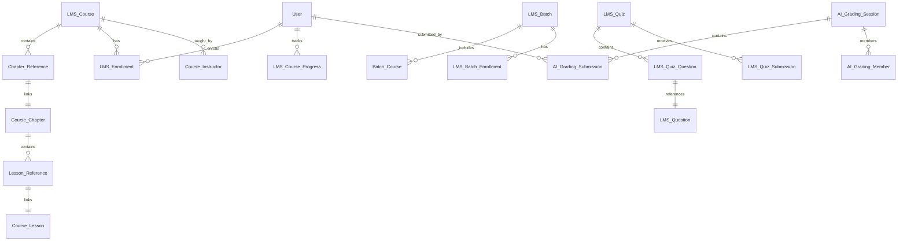

# 🏗️ System Design - Database, Security & Scalability Analysis

> **Phân tích kiến trúc database, bảo mật hệ thống, và khả năng mở rộng** của LMS Application.
> Cập nhật: 2026-04-04

---

## 📊 I. PHÂN TÍCH DATABASE HIỆN TẠI

### 1.1 Database Engine
- **Engine**: MariaDB (InnoDB) — mặc định của Frappe Framework
- **ORM**: Frappe QueryBuilder (PyPika-based)
- **Schema**: Auto-generated từ DocType JSON definitions
- **Migrations**: Managed qua `patches.txt` file

### 1.2 Entity Relationship Diagram (Simplified)



### 1.3 Tổng Số Tables
| Nhóm | Số DocTypes | Ghi chú |
|------|-------------|---------|
| Core Learning | 15 | Course, Chapter, Lesson, Enrollment... |
| Assessment | 10 | Quiz, Assignment, Programming Exercise |
| Batch | 7 | Batch management + timetable |
| Certification | 3 | Certificate, Evaluation, Request |
| AI Grading | 4 | Session, Submission, Member, Settings |
| Payment | 3 | Payment, Coupon |
| Job | 3 | Job Opportunity, Application |
| Social/Profile | 8 | Badge, Review, Skills... |
| Settings/Config | 8 | Settings, Category, Sidebar... |
| **Tổng** | **~61** | |

### 1.4 Vấn Đề Database Hiện Tại

#### ❌ Thiếu Indexes
```sql
-- Các query thường xuyên CHƯA có index tối ưu:
-- 1. Tra cứu enrollment (chạy ở hầu hết mọi request)
SELECT * FROM `tabLMS Enrollment` WHERE member=%s AND course=%s;

-- 2. Course progress tracking
SELECT COUNT(*) FROM `tabLMS Course Progress` 
WHERE course=%s AND member=%s AND status='Complete';

-- 3. AI Grading lookup
SELECT * FROM `tabAI Grading Submission` WHERE session=%s AND student=%s;
```

**Đề xuất thêm indexes:**
```sql
ALTER TABLE `tabLMS Enrollment` ADD INDEX idx_member_course (member, course);
ALTER TABLE `tabLMS Course Progress` ADD INDEX idx_course_member_status (course, member, status);
ALTER TABLE `tabAI Grading Submission` ADD INDEX idx_session_student (session, student);
ALTER TABLE `tabLMS Course` ADD INDEX idx_published_upcoming (published, upcoming);
ALTER TABLE `tabLMS Quiz Submission` ADD INDEX idx_member_quiz (member, quiz);
ALTER TABLE `tabNotification Log` ADD INDEX idx_for_user_read (for_user, `read`);
```

#### ❌ N+1 Query Problem
```python
# HIỆN TẠI: api.py get_courses() - Mỗi course phải query thêm instructors
for course in courses:
    course.instructors = get_instructors("LMS Course", course.name)  # +1 query per course
    # ... more per-course queries
```

**Fix đề xuất**: Sử dụng JOIN hoặc batch query:
```python
# OPTIMIZED:
instructors = frappe.get_all(
    "Course Instructor",
    filters={"parent": ["in", [c.name for c in courses]]},
    fields=["parent", "instructor"],
)
instructor_map = {}
for i in instructors:
    instructor_map.setdefault(i.parent, []).append(i)
```

#### ❌ Không Có Connection Pooling Config
Frappe dùng default MariaDB connection per request. Cần config:
```ini
# site_config.json
{
    "db_pool_size": 20,
    "db_pool_recycle": 3600,
    "db_max_overflow": 10
}
```

---

## 🔐 II. PHÂN TÍCH BẢO MẬT HIỆN TẠI

### 2.1 Kiến Trúc Bảo Mật

```
┌─────────────────────────────────────────────┐
│                   CLIENT                     │
│  (Browser / Mobile App)                      │
└──────────────┬──────────────────────────────┘
               │ HTTPS
┌──────────────▼──────────────────────────────┐
│              NGINX (Reverse Proxy)           │
│  - SSL/TLS Termination                       │
│  - Rate Limiting (basic)                     │
│  - Static file serving                       │
└──────────────┬──────────────────────────────┘
               │
┌──────────────▼──────────────────────────────┐
│          GUNICORN (WSGI Server)              │
│  - Process workers                           │
└──────────────┬──────────────────────────────┘
               │
┌──────────────▼──────────────────────────────┐
│          FRAPPE FRAMEWORK                    │
│  ┌─────────────────────────────────────┐    │
│  │ auth.py - Endpoint Authentication    │    │
│  │  - ALLOWED_PATHS whitelist           │    │
│  │  - System User bypass                │    │
│  │  - LMS path auto-allow              │    │
│  └─────────────────────────────────────┘    │
│  ┌─────────────────────────────────────┐    │
│  │ Frappe Built-in Security             │    │
│  │  - CSRF Token validation             │    │
│  │  - Session management (cookie-based) │    │
│  │  - Password hashing (PBKDF2)         │    │
│  │  - Permission system (DocType level) │    │
│  └─────────────────────────────────────┘    │
│  ┌─────────────────────────────────────┐    │
│  │ API Level Protection                 │    │
│  │  - @frappe.whitelist() decorator     │    │
│  │  - frappe.only_for() role check      │    │
│  │  - @rate_limit decorator (partial)   │    │
│  └─────────────────────────────────────┘    │
└──────────────┬──────────────────────────────┘
               │
┌──────────────▼──────────────────────────────┐
│          MariaDB + Redis                     │
│  - Data at rest (unencrypted by default)     │
│  - Redis for sessions & cache               │
└─────────────────────────────────────────────┘
```

### 2.2 Điểm Mạnh Bảo Mật ✅

| Tính năng | Trạng thái | Chi tiết |
|-----------|-----------|----------|
| HTTPS/SSL | ✅ Có thể config | Qua Nginx + Certbot |
| CSRF Protection | ✅ Frappe built-in | CSRF token tự động |
| Session Management | ✅ Frappe built-in | Cookie-based, Redis-backed |
| Password Hashing | ✅ PBKDF2 | Frappe default |
| RBAC | ✅ 6 roles | System Manager → LMS Student |
| Endpoint Auth | ✅ auth.py | Whitelist approach cho API |
| Rate Limiting | ⚠️ Partial | Chỉ có trên `get_reviews()`, `get_courses()`, `get_chart_data()` |
| API Key Storage | ✅ Password field | AI API keys encrypted at rest |
| Signup Rate Limit | ✅ 300/hour | `sign_up()` function |
| Role Elevation Prevention | ✅ | `sign_up()` strips elevated roles |

### 2.3 Rủi Ro Bảo Mật (Vulnerabilities) ❌

#### 🔴 CRITICAL: SQL Injection Risk
```python
# api.py line 2214 - User input directly in LIKE clause
filters["session_name"] = ["like", f"%{search}%"]

# api.py line 573-574 - Same pattern
or_filters["full_name"] = ["like", f"%{search}%"]
or_filters["email"] = ["like", f"%{search}%"]

# utils.py - Course search filters
or_filters.update({"title": filters.get("title")})
```
**Risk**: Mặc dù Frappe ORM parametrize queries, LIKE patterns với special characters có thể gây behavior không mong đợi. Cần sanitize `%`, `_`, `\` characters.

#### 🔴 CRITICAL: Thiếu Rate Limiting Trên Write Endpoints
```python
# Các endpoint KHÔNG có rate limit:
@frappe.whitelist()
def create_ai_grading_session(data):  # Có thể spam tạo sessions
    
@frappe.whitelist()
def add_ai_grading_submission(...):  # Có thể spam submissions

@frappe.whitelist()
def delete_documents(doctype, documents):  # Bulk delete không giới hạn

@frappe.whitelist()
def save_role(user, role, value):  # Role change không rate limited
```

#### 🟡 HIGH: Insecure Direct Object Reference (IDOR)
```python
# api.py - Một số endpoint không verify ownership
@frappe.whitelist()
def get_ai_grading_session_detail(session):
    return get_ai_grading_session_by_name(session)  # Ai cũng đọc được nếu biết name

@frappe.whitelist()
def save_ai_grading_result(submission_id, data):
    doc = frappe.get_doc("AI Grading Submission", submission_id)
    doc.update(data)  # Ai cũng update được nếu biết ID
    doc.save()
```

#### 🟡 HIGH: SCORM XSS Vulnerability
```python
# api.py line 959 - Malicious code check DISABLED
def extract_package(course, title, scorm_package):
    zip_path = package.get_full_path()
    # check_for_malicious_code(zip_path)  ← COMMENTED OUT!
    zipfile.ZipFile(zip_path).extractall(extract_path)  # ZIP Slip vulnerability
```

#### 🟡 HIGH: File Upload Without Validation
```python
# api.py - _save_ai_grading_submission_image_data
def _save_ai_grading_submission_image_data(data_url, file_name=None):
    # Không validate file type/size
    # Không check for malicious content
    file_doc = frappe.get_doc({
        "doctype": "File",
        "file_name": filename,
        "content": content_bytes,
        "is_private": False,  # Files public by default
    })
```

#### 🟡 MEDIUM: Information Disclosure
```python
# api.py line 80 - Detailed error messages exposed
frappe.throw(f"Access not allowed for this URL: {path}", frappe.PermissionError)
# Exposes internal URL structure to attackers
```

#### 🟡 MEDIUM: Missing Content Security Policy
- Không có CSP headers
- Inline scripts được phép
- External resources không restricted

---

## 🧮 III. ĐÁNH GIÁ KHẢ NĂNG CHỊU TẢI

### 3.1 Hiện Tại: Hệ Thống Đã Đủ An Toàn Cho Production Chưa?

> **Trả lời: ⚠️ CHƯA HOÀN TOÀN.** Hệ thống cần một số cải tiến trước khi sử dụng production với nhiều users.

### 3.2 Khả Năng Phục Vụ Bao Nhiêu Users?

| Metric | Ước Tính | Điều Kiện |
|--------|---------|-----------|
| **10-50 users đồng thời** | ✅ Hoạt động tốt | Config mặc định, server 2-4 CPU, 4GB RAM |
| **100 users đồng thời** | ⚠️ Có thể chậm | Cần tối ưu DB queries, thêm indexes, Gunicorn workers |
| **500+ users đồng thời** | ❌ Không đạt | Cần refactor architecture, caching, load balancing |

### 3.3 Bottlenecks Khi Scale

#### Bottleneck 1: Database Queries
```
Mỗi page load LMS dashboard:
├── get_user_info()           → 2-3 queries
├── get_sidebar_settings()    → 2-3 queries
├── get_my_courses()          → 5-10 queries (N+1)
├── get_streak_info()         → 4-5 queries
└── get_notifications()       → 3-5 queries
TỔNG: ~20-25 queries per page load
```

**Với 100 users đồng thời**: 2000-2500 queries/second → MariaDB default config sẽ bottleneck.

#### Bottleneck 2: Full-Text Search
- SQLite FTS5 chạy single-threaded
- Rebuild index blocking background workers
- Không scale horizontally

#### Bottleneck 3: Synchronous AI Processing
- AI grading API calls block Gunicorn workers
- OpenAI/Gemini API latency: 3-30 seconds
- Với 100 users grading đồng thời: hệ thống sẽ treo

#### Bottleneck 4: File Storage
- Files lưu local filesystem
- Không CDN
- Large SCORM packages cản throughput

---

## 🛠️ IV. CẢI TIẾN CẦN THIẾT ĐỂ PHỤC VỤ 100+ USERS

### Phase 1: Quick Wins (1-2 tuần)

#### 4.1 Database Performance
```ini
# MariaDB config (my.cnf)
[mysqld]
innodb_buffer_pool_size = 2G    # 50-70% RAM
innodb_log_file_size = 256M
innodb_flush_log_at_trx_commit = 2
max_connections = 200
query_cache_type = 1
query_cache_size = 64M
thread_cache_size = 16
```

#### 4.2 Gunicorn Workers
```ini
# Procfile or supervisor config
gunicorn_workers = 9  # (2 * CPU cores) + 1
worker_class = "gthread"
threads = 4
timeout = 120
```

#### 4.3 Redis Configuration
```ini
# redis.conf
maxmemory 512mb
maxmemory-policy allkeys-lru
```

#### 4.4 Thêm Database Indexes (see section 1.4)

### Phase 2: Architecture Improvements (1-2 tháng)

#### 4.5 Caching Layer
```python
# Implement response caching cho heavy reads
CACHE_CONFIG = {
    "get_courses": {"ttl": 300, "vary_by": ["filters", "start"]},
    "get_sidebar_settings": {"ttl": 3600},
    "get_branding": {"ttl": 3600},
    "get_translations": {"ttl": 86400},
    "get_lms_settings": {"ttl": 3600},
}
```

#### 4.6 Async Processing
```python
# Chuyển AI grading sang background jobs
@frappe.whitelist()
def submit_for_ai_grading(submission_id):
    frappe.enqueue(
        'lms.lms.api.ai_grading_api._process_ai_grading',
        queue='long',
        submission_id=submission_id,
        timeout=300,
    )
    return {"status": "queued", "submission_id": submission_id}
```

#### 4.7 Search Migration
```
SQLite FTS5 → Elasticsearch / Meilisearch
- Horizontal scalability
- Real-time indexing
- Better relevance scoring
- Faceted search
```

### Phase 3: Infrastructure (2-3 tháng)

#### 4.8 Load Balancing Architecture

```
                    ┌────────────────────┐
                    │   Load Balancer     │
                    │   (Nginx/HAProxy)   │
                    └──────┬─────┬───────┘
                           │     │
                ┌──────────▼─┐ ┌─▼──────────┐
                │  Worker 1   │ │  Worker 2   │
                │  (Gunicorn) │ │  (Gunicorn) │
                └──────┬──────┘ └──────┬──────┘
                       │               │
                ┌──────▼───────────────▼──────┐
                │      Shared Services         │
                │  ┌─────────┐ ┌────────────┐ │
                │  │ MariaDB │ │   Redis     │ │
                │  │ Primary │ │  Cluster    │ │
                │  └────┬────┘ └────────────┘ │
                │       │                      │
                │  ┌────▼────┐                 │
                │  │ MariaDB │                 │
                │  │ Replica │                 │
                │  └─────────┘                 │
                └──────────────────────────────┘
```

#### 4.9 CDN & File Storage
```
Local Files → S3/MinIO + CloudFront/Cloudflare
- Course images
- SCORM packages
- User uploads
- AI grading paper images
```

#### 4.10 Monitoring Stack
```
Prometheus + Grafana
├── Application metrics (response time, error rate)
├── Database metrics (query time, connections)
├── Redis metrics (hit rate, memory)
├── System metrics (CPU, RAM, disk)
└── Custom LMS metrics:
    ├── Active users
    ├── AI grading queue depth
    ├── Payment success rate
    └── Course completion rate
```

---

## 📊 V. SECURITY CHECKLIST

### Checklist Trước Khi Production

| # | Item | Status | Priority |
|---|------|--------|----------|
| 1 | SSL/TLS (HTTPS) | ❓ Cần verify | Critical |
| 2 | Database encryption at rest | ❌ Chưa có | High |
| 3 | Rate limiting tất cả endpoints | ⚠️ Chỉ 3/50+ endpoints | Critical |
| 4 | Input sanitization | ⚠️ Partial (Frappe ORM) | Critical |
| 5 | SCORM malicious code check | ❌ Disabled | High |
| 6 | File upload validation | ❌ Chưa có | High |
| 7 | IDOR protection | ⚠️ Partial | High |
| 8 | CSP Headers | ❌ Chưa có | Medium |
| 9 | CORS configuration | ❓ Default Frappe | Medium |
| 10 | Backup strategy | ❓ Cần verify | Critical |
| 11 | Log rotation | ❓ OS-level | Medium |
| 12 | Security headers (HSTS, X-Frame) | ❓ Nginx config | Medium |
| 13 | 2FA for admin accounts | ❌ Chưa có | High |
| 14 | Penetration testing | ❌ Chưa thực hiện | Critical |
| 15 | Dependency vulnerability scan | ❌ Chưa có CI | High |

---

## 🏁 VI. KẾT LUẬN

### Trả Lời Câu Hỏi Cốt Lõi:

**Q: Hiện tại đã đủ an toàn cho hệ thống sử dụng chưa?**
> **A:** Chấp nhận được cho **development/staging** và **internal use** (< 50 users). **CHƯA SẴN SÀNG** cho production public-facing với dữ liệu nhạy cảm (thanh toán, thông tin cá nhân).

**Q: 100 users có dùng được không?**
> **A:** **Được**, nhưng cần Phase 1 improvements: thêm database indexes, tăng Gunicorn workers, config MariaDB, và fix critical security issues (rate limiting, input sanitization).

**Q: Nhiều hơn 100 users?**
> **A:** Cần Phase 2-3: caching layer, async processing, load balancing, CDN. Với architecture hiện tại, max **~200-300 concurrent users** là giới hạn hợp lý sau tối ưu.

---

## 📚 Tham Khảo

1. **OWASP Top 10** - [owasp.org/Top10](https://owasp.org/www-project-top-ten/)
2. **Frappe Security Best Practices** - [frappeframework.com/docs/security](https://frappeframework.com/docs)
3. **High Performance MySQL** - Baron Schwartz, O'Reilly
4. **Web Application Security** - Andrew Hoffman, O'Reilly
5. **Site Reliability Engineering** - Google SRE Book
6. **ISO 27001** - Information Security Management
7. **GDPR Requirements** for educational data
